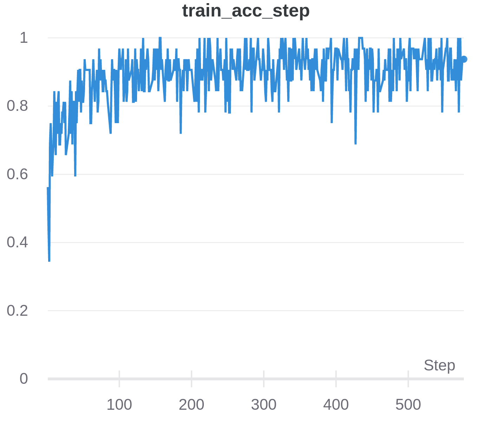
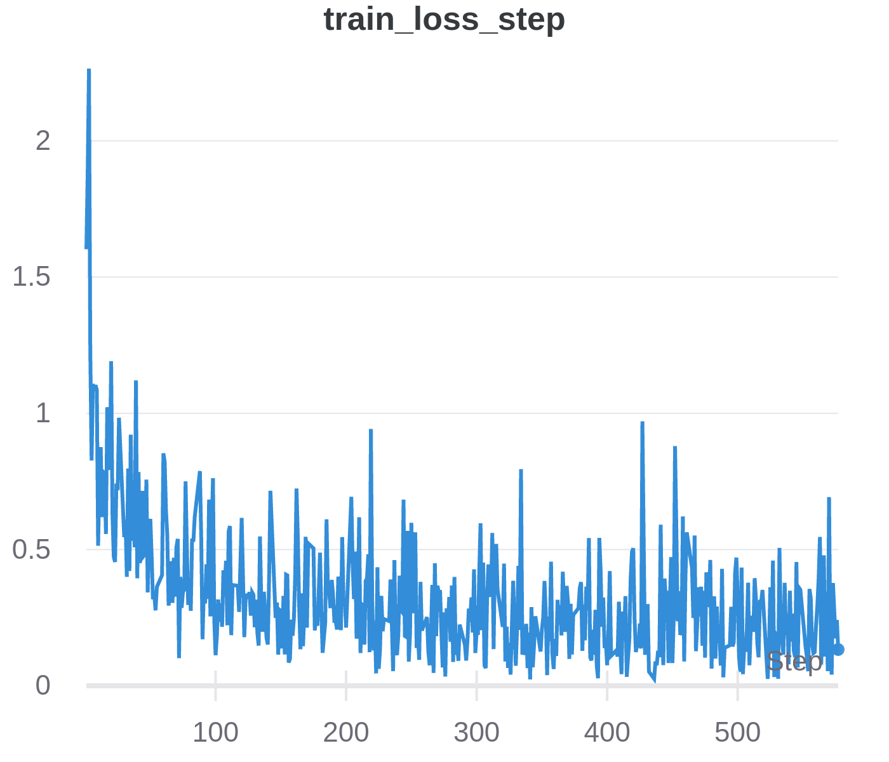
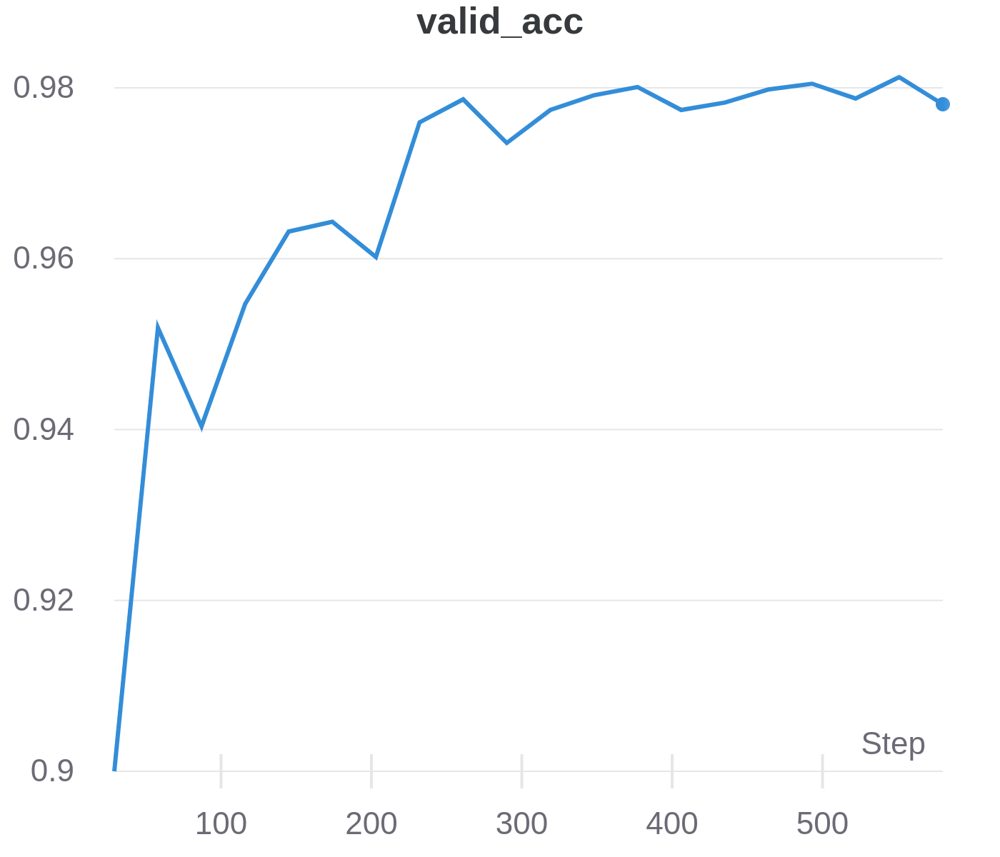
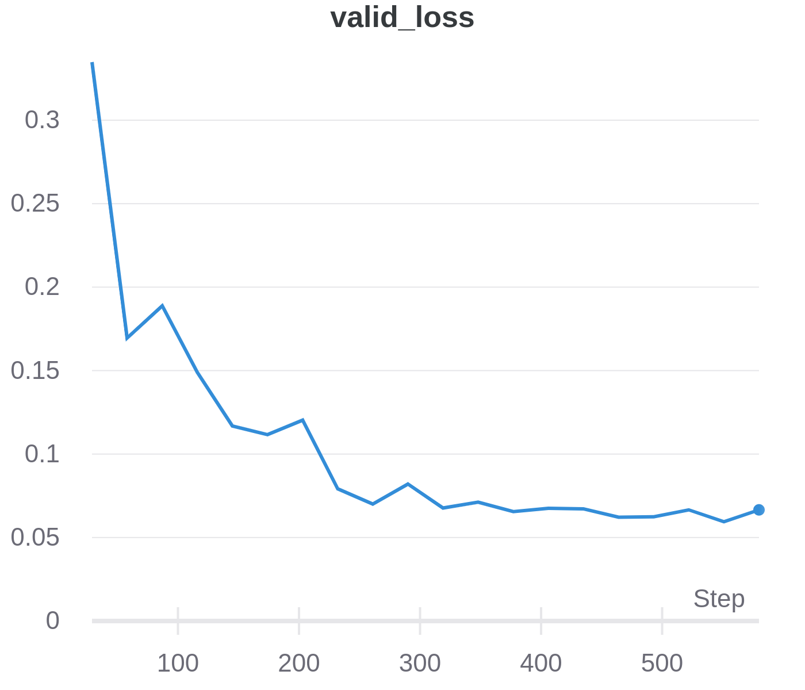

# Handwritten Hindi Character Recogintion
<br>
> Character Recognition is the identification of printed characters from an image, a book, a handwritten note, cheques, or letters so that it can distinguish between different characters and can convert them from image to character. With the increasing need for character recognition models, so using deep learning and image processing methods we propose our solution to recognition of Devanagiri characters which forms the basis of many laguages.
<br>

## Approach & Optimizations

The whole **pipeline** is a 3 stage process:

- **Preprocess** the image for removing extra space and noise using image processing in OpenCV.
- **Segmentation** of characters from cropped word image using contour detection
- **Character Recognition** of individual contours(handwritten character) using a CNN network.

The captcha image is processed as follows:

- extra blank region removal
- noise removal and extra lines filtering 
- Removing header line of hindi word to separate the characters.
- Segmenting characters as contours.

A rule based character segmentation is performed using contours. As in Hindi characters, some of the characters are made of more than 1 contours such as **श, ग** etc. are removed, and the model is trained on 26 letters which are chosen by analysing the confusion matrix of all 36 characters(consonants). Our objective was to make a classifier that can give maximum performance on the characters given for prediction.  
<br>
```The characters chosen are mentioned in character.txt``` 
<br>  
We add several checks over expected dimensions of charcter blobs to select only those contours that are characters. Then the segmented characters are passed through a CNN classifier for recognition.

## Run this project

Run locally  
- Clone the project

```bash
  git clone https://github.com/harshRaj2017/Hindi-Captcha-Recognition.git
```

- Go to the project directory

```bash
  cd Hindi-Captcha-Recognition
```

- Install dependencies

```bash
  pip install -r requirements.txt
```

- Make predictions

```bash
  python main.py --image_path path/to/image
```
## Dataset Description
A very popular Devanagari handwritten character dataset.  
Link: http://archive.ics.uci.edu/ml/datasets/Devanagari+Handwritten+Character+Dataset

Contains **92,000 Images** belonging to 46 Devanagiri classes of 36 consonants and 10 digits from 0-9.
Image Size : 32x32

## Training Metrics & Snapshots
|  |   |
|----|----|
|<br>Training Accuracy|<br>Training Loss|
|<br>Validation Accuracy|<br>Validation Loss|
 


## Our Team:
<table>
<tr>
      <td align="center"><a href="https://github.com/harshRaj2017"><br /><sub><b>Harsh Raj</b></sub></a></td>
      <td align="center"><a href="https://github.com/carrotBoiii"><br /><sub><b>Swagat Nayak</b></a></td>
      
</tr>
</table>


<!-- ## Procedure


<br>

## Acknowledgements

- [Ultralytics YOLOv5](https://github.com/ultralytics/yolov5) -->